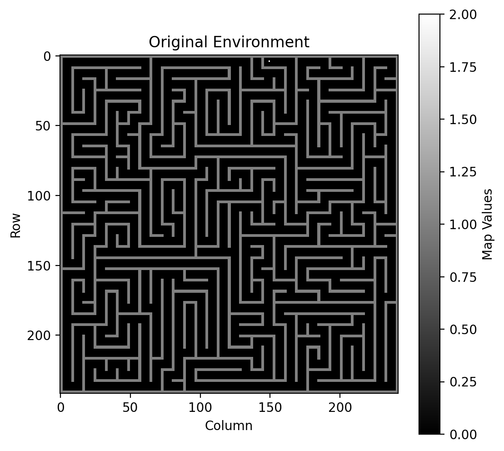
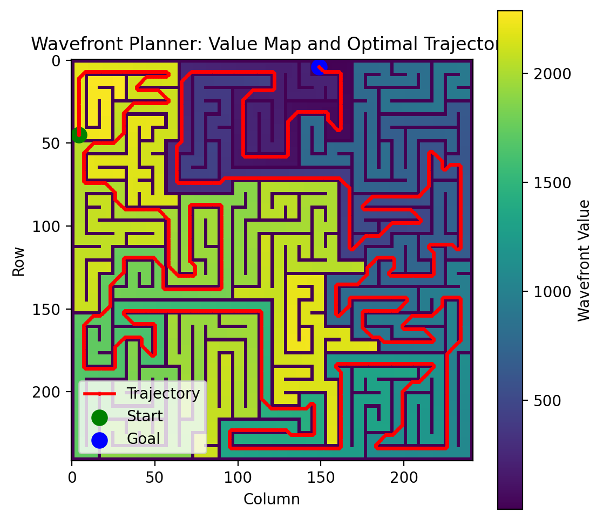

# Wavefront Path Planner 

The Wavefront Path Planner is a Python-based path planning tool that utilizes the wavefront algorithm to compute an optimal trajectory from a given start position to a goal in a 2D grid environment. The application is built using Streamlit for interactivity and visualization.

## Features
- Load .mat environment files
- Select a starting position via sidebar input.
- Compute the shortest path using the wavefront algorithm.
- Visualize the environment and the computed trajectory.
- Download the computed trajectory as a text file.

## Installation
```bash
pip install streamlit numpy scipy matplotlib
```

## Usage 💻

1. Install dependencies:
```bash
pip install streamlit numpy scipy matplotlib
```
2. Run the application:
```bash
streamlit run app.py
```

## File Structure 📂

```plaintext
├── app.py                  # Main Streamlit application
├── Wavefront_Path_functions.py  # Algorithm implementation
├── input_maps        # Sample environment Folder
│   ├── maze.mat   
│   └── maze1.mat
│   └── maze2.mat 
├── images/               
│   ├── original_map.png    
│   └── wavefront_path.png  
└── README.md            
```

## How It Works ⚙️

### Environment Setup
- Upload a .mat file: The .mat file should contain a 2D NumPy array named map, where:
  - `0`: represents free space.
  - `1`: represents obstacles.
  - `2`: represents the goal position.

### Path Calculation
- Wavefront algorithm propagates values from goal
- Optimal path extracted using gradient descent
- Runtime performance metrics displayed

### Visualization
- The Original Map is displayed.
- The Wavefront Value Map with Trajectory is displayed, showing the computed path.
 
 

### Data Export
- Download computed path as `.txt` file
- File contains ordered list of `(X,Y)` coordinates

## Dependencies 📦
- `Python 3.8+`
- `streamlit >=1.22` - Web interface
- `numpy >=1.21` - Matrix operations
- `scipy >=1.7` - .mat file handling
- `matplotlib >=3.5` - Visualization

| Name | GitHub | LinkedIn |
| ---- | ------ | -------- |
| Omar Adel Hassan | [@Omar_Adel](https://github.com/omar-adel1) | [](https://www.linkedin.com/in/omar-adel-59b707231/) |
| Yara Ihab Mohamed | [@Yara_Ihab](https://github.com/YaraIhab2) | [](https://www.linkedin.com/in/yara-ihab-022061268/) |

## Acknowledgements

Submitted to: Dr. Ibrahim Sadek

All rights reserved © 2025 to HealthCare Engineering and Management, Cairo University (Class 2025)
